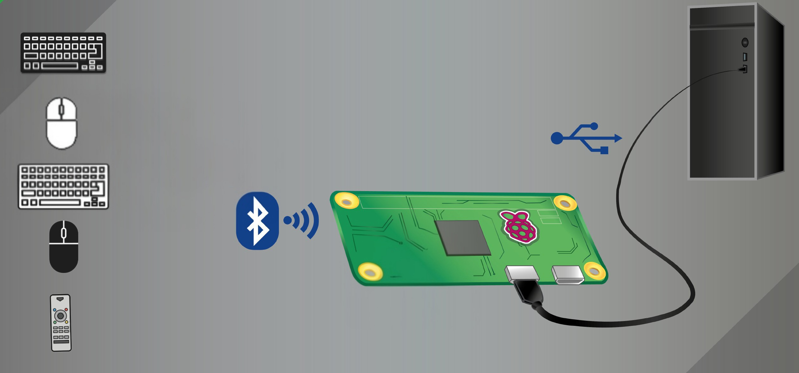
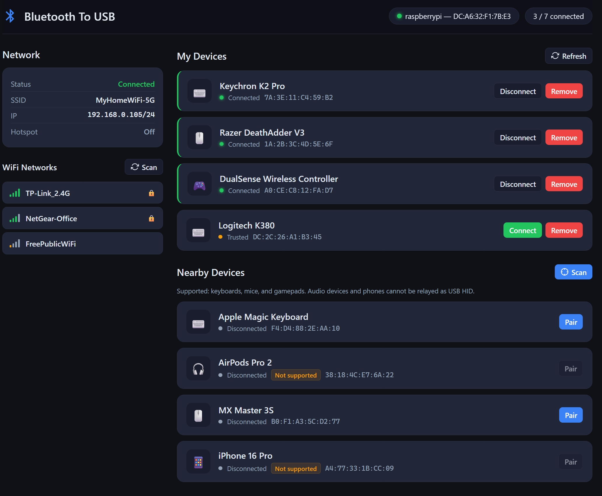

<!-- omit in toc -->
# Bluetooth-to-USB HID Bridge for Raspberry Pi — with Web GUI

```
     ┌──────────────────┐         ┌──────────────────┐         ┌──────────────────┐
     │  🎮 Gamepad      │         │                  │         │                  │
     │  ⌨️  Keyboard     │───BT───▶│   Raspberry Pi   │───USB──▶│   Target Host    │
     │  🖱️ Mouse        │         │   (HID Bridge)   │         │  (PC / Console)  │
     └──────────────────┘         └──────────────────┘         └──────────────────┘
       Bluetooth Input              Converts BT → USB            Sees standard USB
       (wireless)                   keyboard & mouse             keyboard & mouse
```

A fork of [quaxalber/bluetooth_2_usb](https://github.com/quaxalber/bluetooth_2_usb) that adds a **web-based management GUI**, **fallback WiFi AP**, **gamepad-to-keyboard mapping**, and **boot optimizations**.

Use Bluetooth keyboards, mice, and gamepads in BIOS and boot menus, installers, kiosks,
tablets, KVM setups, retro systems, consoles, and other hosts where Bluetooth
is unavailable or inconvenient.

Bluetooth-2-USB turns a Raspberry Pi into a USB HID bridge for Bluetooth
devices. To the target host, the Pi appears as a standard wired USB
keyboard and mouse — no Bluetooth support, pairing flow, or special drivers
required on the target system.



## Web GUI



## What this fork adds

| Feature | Description |
| --- | --- |
| **Web GUI** | Manage Bluetooth devices from a browser — scan, pair, connect, disconnect, remove. Accessible at `http://<pi-ip>:8080` |
| **Network management** | View WiFi status, scan and connect to networks, all from the web UI |
| **Fallback WiFi AP** | When no known WiFi is available, the Pi creates a hotspot so you can always reach the web UI |
| **Multi-device support** | Pair and relay multiple Bluetooth HID devices simultaneously (up to 7) |
| **Gamepad support** | Xbox/PS controllers mapped to keyboard keys (A→Enter, B→Escape, X→Space, etc.) |
| **Auto-connect** | Paired devices are automatically trusted — they reconnect when in range |
| **BLE pairing agent** | Proper `NoInputNoOutput` agent registration for BLE device pairing |
| **Unsupported device detection** | Audio devices and phones are flagged as unsupported in the UI |
| **Boot optimizations** | Disables unnecessary services — reduces boot time by ~10 seconds |
| **Processing indicators** | Visual feedback during pair/connect operations with spinner states |

## Prerequisites

- **Raspberry Pi** Zero W, Zero 2 W, 4B, or 5
- **OS**: Raspberry Pi OS Bookworm or newer
- **Internet** access during installation
- **USB cable** that supports data (not charge-only)
- One or more **Bluetooth HID devices** (keyboard, mouse, or gamepad)

> [!NOTE]
> Pi 3 models include Bluetooth but do not expose a suitable device-mode USB port.
> On **Pi 4B / 5**, the OTG-capable port is the USB-C power port.
> On **Pi Zero** boards, the OTG-capable port is the USB data port (not the power-only port).

## Quick start

### 1. Install the base bluetooth_2_usb

```bash
sudo apt update && sudo apt install -y git
sudo git clone https://github.com/Qutaiba-Khader/bluetooth_2_usb_gui.git /opt/bluetooth_2_usb
cd /opt/bluetooth_2_usb && sudo env PYTHONPATH=src python3 -m bluetooth_2_usb install
```

### 2. Reboot

```bash
sudo reboot
```

### 3. Install the Web GUI

```bash
cd /opt/bluetooth_2_usb && sudo bash bt_web/setup.sh
```

### 4. Reboot again (for boot optimizations)

```bash
sudo reboot
```

### 5. Open the Web GUI

Open `http://<pi-ip>:8080` in your browser. If you don't know the Pi's IP, connect to the fallback WiFi:

| Setting | Value |
| --- | --- |
| SSID | `Bluetooth To USB` |
| Password | `1111111111` |
| Web UI | `http://10.42.0.1:8080` |

### 6. Connect the Pi to the target host

```
    ┌────────┐   USB-C   ┌───────────┐
    │  Pi 4B │══════════▶│  Target   │   Use the USB-C power port
    │  Pi 5  │           │   Host    │
    └────────┘           └───────────┘

    ┌────────┐   USB     ┌───────────┐
    │ Pi Zero│══════════▶│  Target   │   Use the USB data port
    │  W/2W  │           │   Host    │   (not the power-only port)
    └────────┘           └───────────┘
```

## Web GUI features

### Bluetooth management

- **Scan** for nearby Bluetooth devices
- **Pair** devices with one click (BLE + Classic)
- **Connect / Disconnect** paired devices
- **Remove** devices with confirmation dialog
- **Trust** devices for auto-reconnect
- **Processing states** with visual spinner feedback
- **Device limit** display (connected / max in header)
- **Unsupported** devices flagged (audio, phones) with disabled pair button
- Devices are removed from the nearby list after pairing

### Network management

- View current WiFi connection (SSID, IP address)
- View fallback AP status
- Scan for available WiFi networks
- Connect to a WiFi network with password
- Signal strength bars for each network

### Fallback WiFi AP

When the Pi cannot connect to any known WiFi network, it automatically creates a WiFi hotspot:

- **SSID:** `Bluetooth To USB`
- **Password:** `1111111111`
- **IP:** `10.42.0.1`
- The AP shuts down automatically when WiFi reconnects
- The AP activates automatically when WiFi disconnects

### Gamepad button mapping

Xbox and similar Bluetooth gamepads are supported via keyboard key mapping:

| Gamepad Button | Keyboard Key |
| --- | --- |
| A (South) | Enter |
| B (East) | Escape |
| X (North) | Space |
| Y (West) | Backspace |
| LB / RB | Page Up / Page Down |
| LT / RT | Left Shift / Right Shift |
| View / Select | Tab |
| Menu / Start | Enter |
| Xbox / Mode | Escape |
| Left Stick Click | Left Ctrl |
| Right Stick Click | Left Alt |

> [!NOTE]
> Analog sticks and D-pad use absolute axis events and are not mapped in the current version.

## Supported devices

| Type | Supported | Notes |
| --- | --- | --- |
| ⌨️ Keyboard | Yes | Full key relay |
| 🖱️ Mouse | Yes | Movement, buttons, scroll |
| 🎮 Gamepad | Yes | Buttons mapped to keyboard keys |
| 🎧 Audio | No | Cannot relay as USB HID |
| 📱 Phone | No | Cannot relay as USB HID |

## Architecture

```
bt_web/
├── main.py              # FastAPI application
├── bt_manager.py        # Bluetooth operations via bluetoothctl
├── net_manager.py       # Network operations via nmcli
├── setup.sh             # Installation script
├── bt-web.service       # systemd service for the web UI
├── bt2usb-ap-fallback.service  # Boot-time AP fallback check
├── 99-bt2usb-ap         # NetworkManager dispatcher for AP fallback
└── static/
    ├── index.html        # Two-column responsive layout
    ├── style.css         # Dark theme UI
    └── app.js            # Frontend logic
```

## Boot optimizations

The setup script disables unnecessary services to reduce boot time on a dedicated Pi:

| Disabled service | Time saved | Reason |
| --- | --- | --- |
| `cloud-init` (5 units) | ~5s | Cloud VM provisioning, not needed on Pi |
| `NetworkManager-wait-online` | ~3.5s | Nothing needs to block on network |
| `e2scrub_reap` | ~1.5s | Filesystem scrub can be run manually |
| `udisks2` | ~0.5s | Disk management not needed headless |
| `keyboard-setup` / `console-setup` | ~0.6s | Headless Pi, no local console |

The `bt-web` service starts with `Type=idle` and `Nice=10` so it does not compete with `bluetooth_2_usb` at boot.

## Managed paths

| Path | Purpose |
| --- | --- |
| `/opt/bluetooth_2_usb` | Managed installation root |
| `/opt/bluetooth_2_usb/bt_web` | Web GUI application |
| `/opt/bluetooth_2_usb/venv` | bluetooth_2_usb virtual environment |
| `/opt/bluetooth_2_usb/bt_web/venv` | Web GUI virtual environment |
| `/etc/default/bluetooth_2_usb` | Runtime settings |
| `/etc/systemd/system/bt-web.service` | Web GUI service unit |
| `/etc/systemd/system/bt2usb-ap-fallback.service` | Boot AP fallback unit |
| `/etc/NetworkManager/dispatcher.d/99-bt2usb-ap` | AP fallback dispatcher |

## Updating

```bash
cd /opt/bluetooth_2_usb
sudo git pull
sudo env PYTHONPATH=src python3 -m bluetooth_2_usb install
sudo bash bt_web/setup.sh
sudo reboot
```

## Uninstalling the Web GUI

```bash
sudo systemctl disable --now bt-web.service bt2usb-ap-fallback.service
sudo rm /etc/systemd/system/bt-web.service /etc/systemd/system/bt2usb-ap-fallback.service
sudo rm /etc/NetworkManager/dispatcher.d/99-bt2usb-ap
sudo nmcli connection delete bt2usb-hotspot
sudo rm -rf /opt/bluetooth_2_usb/bt_web
```

## Troubleshooting

See [TROUBLESHOOTING.md](TROUBLESHOOTING.md) for base bluetooth_2_usb issues.

For the Web GUI:

```bash
# Check service status
sudo systemctl status bt-web.service

# View logs
sudo journalctl -u bt-web.service -f

# Check AP status
nmcli connection show --active | grep bt2usb

# Restart the web UI
sudo systemctl restart bt-web.service
```

## License

This project is licensed under the [MIT License](LICENSE).

## Acknowledgments

- [quaxalber/bluetooth_2_usb](https://github.com/quaxalber/bluetooth_2_usb) — the original project this fork is based on
- [Mike Redrobe](https://github.com/mikerr/pihidproxy) for the original Pi HID proxy idea
- [Adafruit](https://www.adafruit.com/) for CircuitPython HID and Blinka
- Everyone who tests the project on real hardware

---

<div align="center">

Forked and extended by [Qutaiba Khader](https://github.com/Qutaiba-Khader)

</div>
